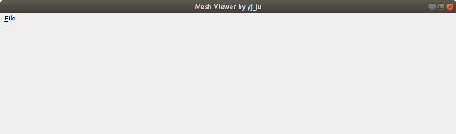
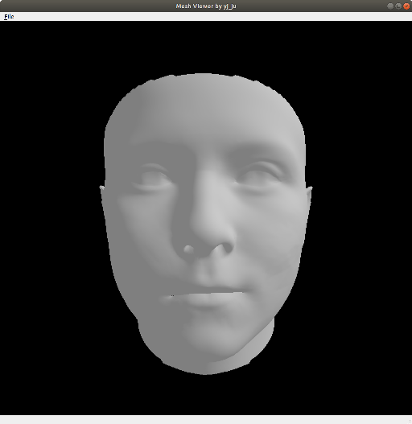
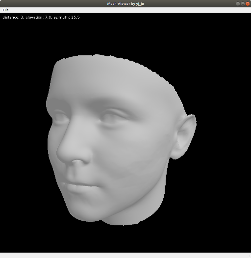
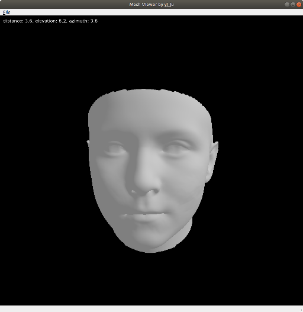

## Mesh Viewer using pytorch3D

This code is implemented using Pytorch3D and PyQt5

### Installation

The code uses **Python 3.7** in **Ubuntu 18.04 LTS**

[Pytorch3D](https://github.com/facebookresearch/pytorch3d)

You can install Pytorch3D in upper link.

To install

~~~
git clone https://github.com/yeongjoonJu/Mesh-Viewer-using-pytorch3d.git
cd Mesh-Viewer-using-pytorch3d
mkdir data
pip install pyqt5
pip install pillow
~~~

### Run

~~~
python main.py
~~~

### Examples

You can open .obj file after pressing file button.

**Rotation**

You can rotate object through dragging mouse.

**Zoom in/out**

You can zoom in/out through wheeling.

